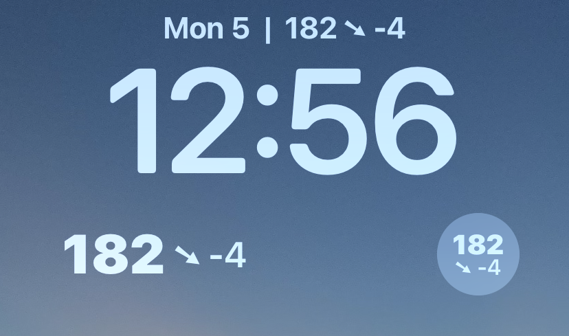
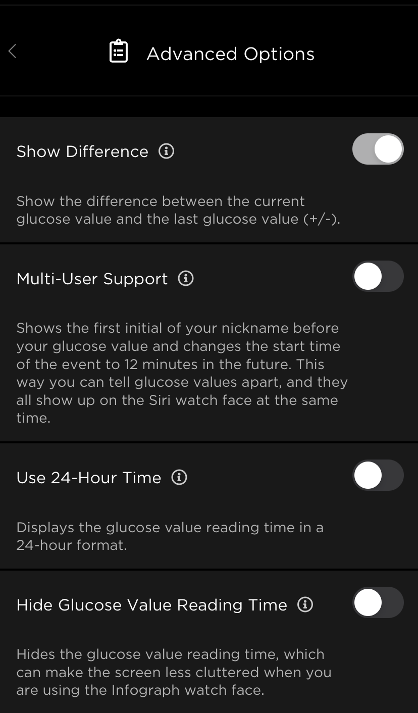

# Add your bloodsugar to the iOS 16 lockscreen!

## Warning

- Because of how iOS manages widgets, the reading shown may be one or two readings behind.

## Required setup:
- Must be using the Sugarmate app with the Apple Watch iCloud calendar enabled. Calendar must be named "Sugarmate Readings".

- It probably works with other settings but I am using these:

     - 